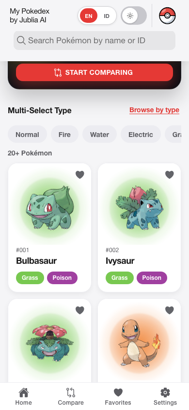
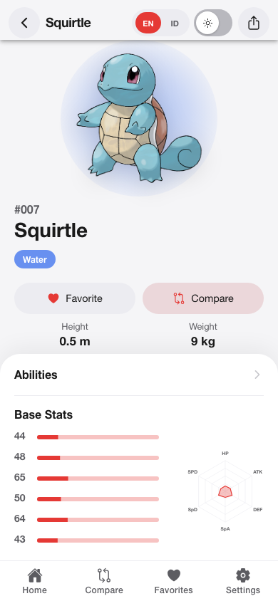
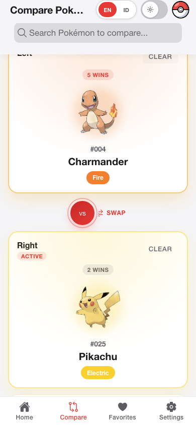
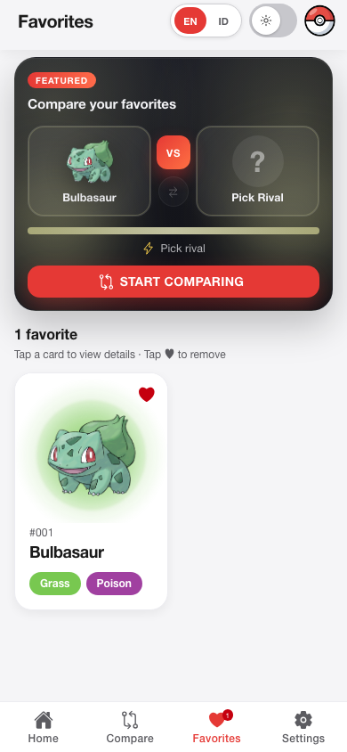
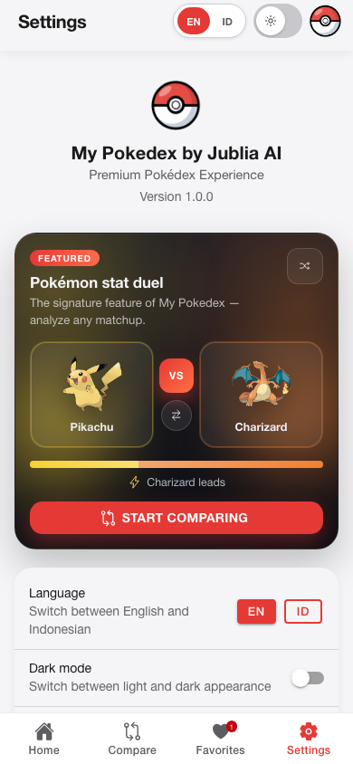
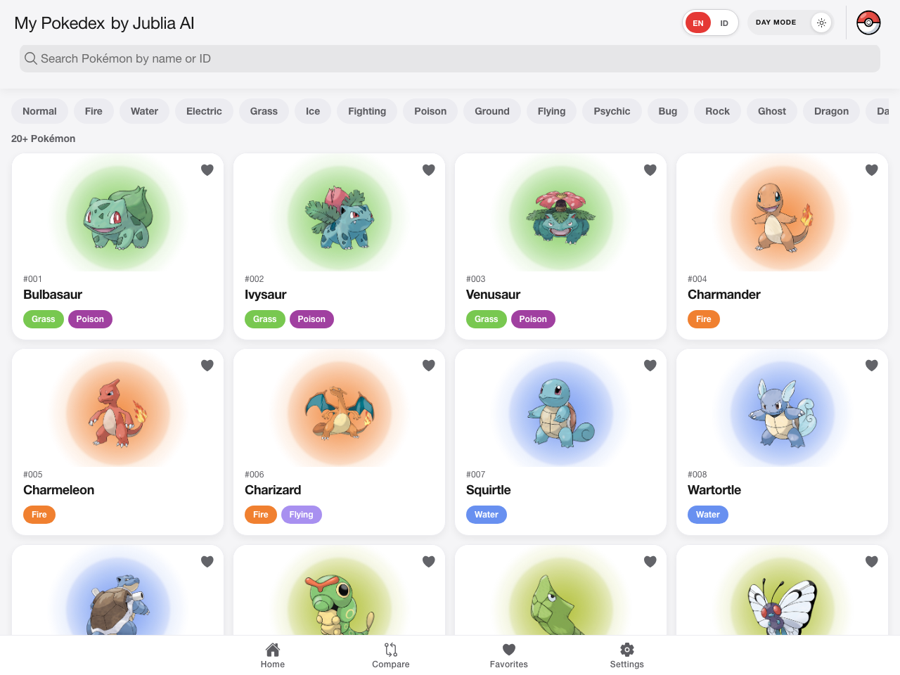
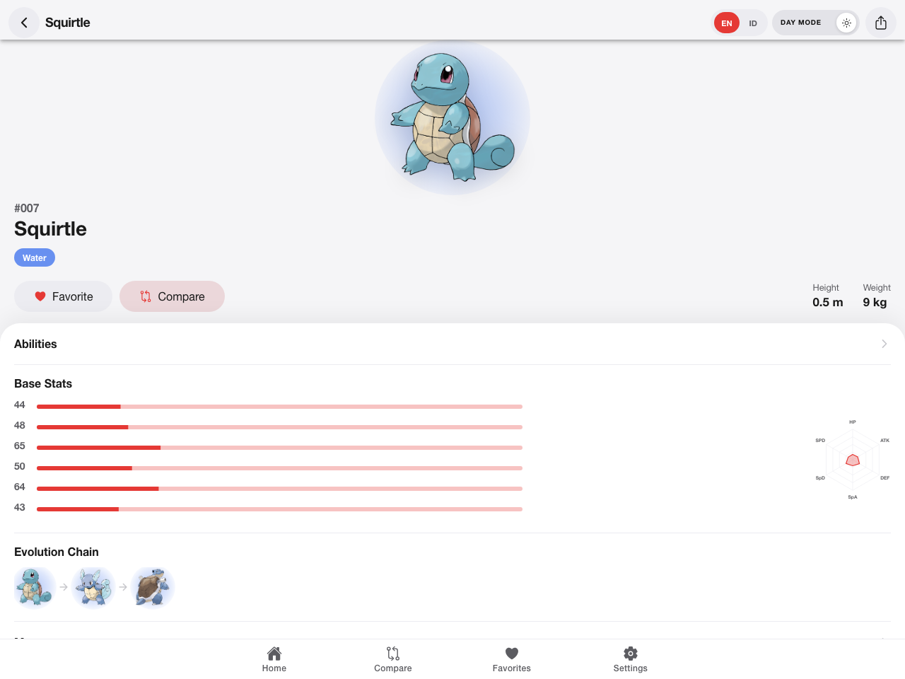
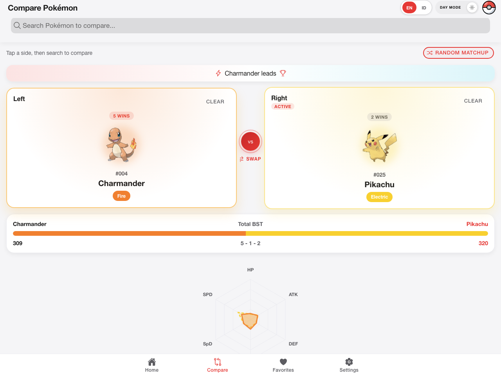

# My Pokedex by Jublia AI

[](https://alxjeff182.github.io/jublia-pokedex/)
[](https://github.com/alxjeff182/jublia-pokedex/actions/workflows/ci.yml)
[](https://github.com/alxjeff182/jublia-pokedex/actions/workflows/deploy.yml)

Premium Pokédex experience for web, iOS, and Android — browse every Pokémon, dive into rich detail pages, save favorites, and compare stats head-to-head.

**[Live demo](https://alxjeff182.github.io/jublia-pokedex/)** · **[Figma design](https://www.figma.com/design/QqH1OAWzDrtleQ77xrxlxR/My-Pokedex-by-Jublia-AI)** · **[Documentation](docs/README.md)**

---

## Preview

### Mobile

| Home | Detail | Compare |
|:---:|:---:|:---:|
|  |  |  |

| Favorites | Settings |
|:---:|:---:|
|  |  |

### Desktop

| Home | Detail | Compare |
|:---:|:---:|:---:|
|  |  |  |

---

## Highlights

- **Full Pokédex browsing** — infinite scroll, search by name or ID, multi-select type filters
- **Rich detail pages** — artwork, base stats with radar chart, abilities, moves, evolution chain
- **Favorites** — persisted locally via Capacitor Preferences
- **Stat duel** — compare two Pokémon side-by-side with BST bars and radar overlay
- **Polished UX** — splash screen, light/dark theme, EN/ID i18n, offline banner, haptics on native
- **Production-ready** — CI/CD, 85%+ test coverage, Playwright e2e, GitHub Pages deploy

---

## Tech stack

| Layer | Choice |
|---|---|
| Framework | Angular 20 (standalone components, signals) |
| UI | Ionic Angular 8 |
| Native | Capacitor 8 (iOS + Android) |
| API | [PokéAPI](https://pokeapi.co/) REST |
| Testing | Karma + Playwright |
| Deploy | GitHub Actions → GitHub Pages |

Design tokens live in [`src/theme/design-tokens.scss`](src/theme/design-tokens.scss). The Figma file includes Design System, Components, and screen frames in light/dark. Regenerate designs locally with [`scripts/figma-design/`](scripts/figma-design/README.md).

---

## Quick start

```bash
git clone https://github.com/alxjeff182/jublia-pokedex.git
cd jublia-pokedex
npm install
npm start
```

Open **http://localhost:8100**

### Other commands

| Command | Description |
|---|---|
| `npm run build` | Production build → `www/` |
| `npm test` | Unit & component tests |
| `npm run test:ci` | Headless tests + coverage gate |
| `npm run e2e` | Playwright smoke tests |
| `npm run e2e:screenshots` | Regenerate preview images → `docs/screenshots/` |
| `npm run cap:ios` / `cap:android` | Sync web assets and open native IDE |

**Prerequisites:** Node.js 20+ (see `.nvmrc`), npm 10+. For e2e: `npx playwright install chromium`.

---

## Project structure

```text
src/app/
  core/       # services, models, guards, interceptors
  shared/     # reusable UI (cards, chips, charts, headers)
  features/   # screens — list, detail, compare, favorites, settings, browse
```

See [`docs/architecture.md`](docs/architecture.md) for data flow, caching, and routing.

---

## Documentation

| Doc | What's inside |
|---|---|
| [**docs/README.md**](docs/README.md) | Documentation index |
| [architecture.md](docs/architecture.md) | Layers, PokéAPI integration, Capacitor |
| [development-guidelines.md](docs/development-guidelines.md) | Ionic-first styling, signals, conventions |
| [testing-strategy.md](docs/testing-strategy.md) | Unit, component, and e2e testing |
| [deployment.md](docs/deployment.md) | GitHub Pages, iOS/Android release |
| [accessibility-checklist.md](docs/accessibility-checklist.md) | WCAG-oriented checklist |
| [CONTRIBUTING.md](CONTRIBUTING.md) | PR checklist and CI requirements |

---

## Author

**Jeffry** — [GitHub @alxjeff182](https://github.com/alxjeff182)

Portfolio project showcasing modern Angular + Ionic + Capacitor development with real-world API integration, design-system discipline, and automated quality gates.
