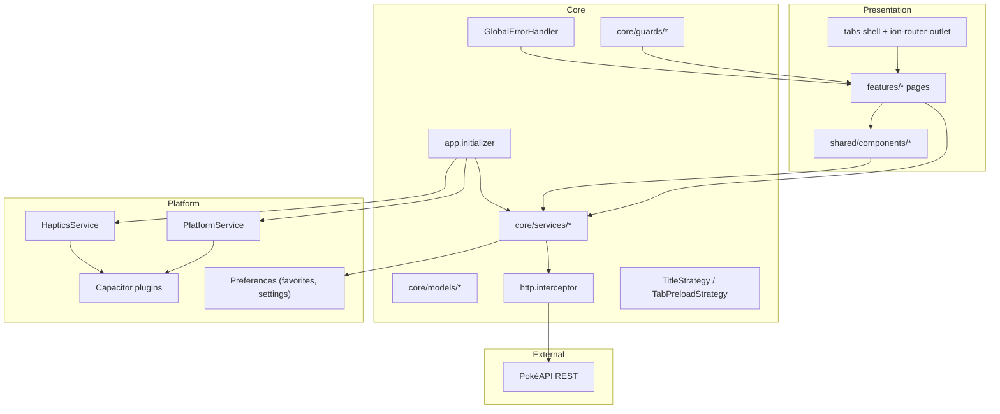

# Architecture — My Pokedex by Jublia AI

High-level overview of how the Angular 20 + Ionic 8 + Capacitor 8 app is structured, how data flows through it, and how native platforms are integrated.

---

## Layer diagram



---

## Directory layout

```text
src/app/
  core/
    constants/     # design tokens (TS)
    guards/        # route guards (e.g. pokemonIdGuard)
    handlers/      # GlobalErrorHandler
    initializers/  # app startup (favorites, haptics, native)
    interceptors/  # HTTP timeout, retry, ApiError mapping
    models/        # PokéAPI DTOs and view models
    services/      # all PokéAPI and app-state access
    strategies/    # document title + tab preloading
  shared/
    components/    # reusable UI (pokemon-card, type-chip, …)
  features/
    splash/        # boot screen
    tabs/          # bottom-tab shell
    pokemon-list/  # home / infinite scroll
    browse/        # type browser
    favorites/     # saved Pokémon
    compare/       # side-by-side stats
    settings/      # app preferences
    pokemon-detail/ # detail screen
```

All components are **standalone** — no NgModules. Bootstrap uses `bootstrapApplication` in `src/main.ts`.

---

## Data flow

### Pokémon list (home)

1. `PokemonListPage` reads search/type filters from the URL query string and local signals.
2. `PokemonService.getPokemonPage()` resolves filtered IDs, then fetches detail payloads in batches of five.
3. Details are mapped to `PokemonCardData` via `toCardData()` and rendered by `app-pokemon-card`.
4. `IonInfiniteScroll` requests the next page slice when the user reaches the bottom.

### Search and type filter

1. **Search** — `PokemonService.getNameIndex()` loads the full name/ID index once (`limit=1300`), then filters client-side by name or ID substring.
2. **Type filter** — `PokemonTypeService.getTypePokemonIds()` fetches `GET /type/{name}` per selected type. `PokemonService.getFilteredIds()` intersects type ID sets (AND logic).
3. **Browse tab** — `BrowsePage` navigates to `/tabs/home?type=fire` (etc.) so filters are shareable and bookmarkable.

### Detail, evolution, and compare

1. `PokemonDetailPage` loads `getPokemonDetail`, `getFlavorText`, and `getEvolutionChain` in parallel.
2. `pokemonIdGuard` validates `:id` (integer 1–1025) before the detail route activates.
3. `ComparePage` uses `searchPokemonByName()` and `getCardsByIds()` for slot selection and stat comparison.

### Favorites

1. `FavoritesService` holds favorite IDs in an Angular `signal<Set<number>>`.
2. On toggle, IDs persist to Capacitor **Preferences** (`jublia_dex_favorites`).
3. `FavoritesPage` resolves card data via `PokemonService.getCardsByIds()`.

---

## Caching

| Layer | Mechanism | Scope |
|---|---|---|
| Name index | `shareReplay(1)` on first `getNameIndex()` call | Session — single observable reused |
| Pokémon detail | `Map<number, Observable<PokemonDetail>>` + `shareReplay(1)` | Per-ID — deduplicates in-flight and repeat requests |
| Type IDs | `Map<string, Observable<number[]>>` + `shareReplay(1)` | Per type name |
| Favorites / haptics prefs | Capacitor Preferences | Cross-session on device/browser |

There is no HTTP cache interceptor — caching is handled in services. Batched detail fetches (`batchSize = 5`) limit concurrent PokéAPI calls during list rendering.

---

## HTTP and error handling

All HTTP traffic goes through `provideHttpClient(withFetch(), withInterceptors([httpInterceptor]))`.

The `httpInterceptor` (`src/app/core/interceptors/http.interceptor.ts`):

- Applies a **10 s timeout** per request.
- **Retries once** on 5xx responses (500 ms delay).
- Maps `HttpErrorResponse` to `ApiError` with status and URL.
- Logs request details in non-production builds.

`GlobalErrorHandler` surfaces uncaught errors as Ionic toasts (production logs JSON for future observability hooks).

**Rule:** pages and components must not call PokéAPI directly. Use `core/services/*` only.

---

## Routing

| Path | Screen | Notes |
|---|---|---|
| `/splash` | Splash | Default redirect from `/` |
| `/tabs/home` | Pokémon list | Default tab; supports `?type=` query |
| `/tabs/browse` | Type browser | Navigates to home with type filter |
| `/tabs/favorites` | Favorites | |
| `/tabs/settings` | Settings | Haptics toggle, clear favorites, compare link |
| `/tabs/compare` | Compare | |
| `/tabs/pokemon/:id` | Detail | Guarded by `pokemonIdGuard` |

**Lazy loading** — every route uses `loadComponent()` for code splitting.

**Preloading** — `TabPreloadStrategy` eagerly preloads `home`, `browse`, and `favorites` tab routes after bootstrap.

**Deep links** — `/pokemon/:id` and `/compare` redirect into the tabs shell.

**Ionic integration** — `IonicRouteStrategy` preserves scroll position across tab navigations; `AppTitleStrategy` sets `document.title` from route `data.title`.

---

## Capacitor integration

### Build output

`ng build` writes to `www/` (Angular puts the browser bundle in `www/browser/`). Capacitor reads `webDir: 'www/browser'` from `capacitor.config.ts`.

### App initializer

`appInitializer` runs before the first route:

1. `FavoritesService.init()` — load saved favorites from Preferences.
2. `HapticsService.init()` — load haptics preference.
3. `PlatformService.initializeNative()` — native-only setup.

### PlatformService (native only)

When `Capacitor.isNativePlatform()`:

- Sets status bar style and background (`#f5f5f7`).
- Configures keyboard resize mode (`KeyboardResize.Body`).
- Hides the native splash screen.
- Registers Android hardware back-button handler (`window.history.back()`).

### Plugins in use

| Plugin | Purpose |
|---|---|
| `@capacitor/preferences` | Favorites persistence, haptics setting |
| `@capacitor/haptics` | Light impact / selection feedback |
| `@capacitor/status-bar` | Native status bar appearance |
| `@capacitor/keyboard` | Keyboard resize on native |
| `@capacitor/splash-screen` | Hide launch splash |
| `@capacitor/app` | Back-button listener |

`HapticsService` no-ops gracefully on web. Toggle is exposed in Settings.

### Native workflow

```bash
npm run cap:sync    # build + cap sync
npm run cap:ios     # sync + open Xcode
npm run cap:android # sync + open Android Studio
```

See [`docs/deployment.md`](deployment.md) for release steps.

---

## State management

Component-local UI state uses **Angular signals** (`signal`, `computed`, `effect`). Shared app state lives in root-injectable services with readonly signal exposure (`FavoritesService.favorites`).

No NgRx or external store — the app scope does not require it.

---

## Related docs

- [Development guidelines](development-guidelines.md) — styling and conventions
- [Testing strategy](testing-strategy.md) — unit, component, and e2e tests
- [Deployment](deployment.md) — web and native release
